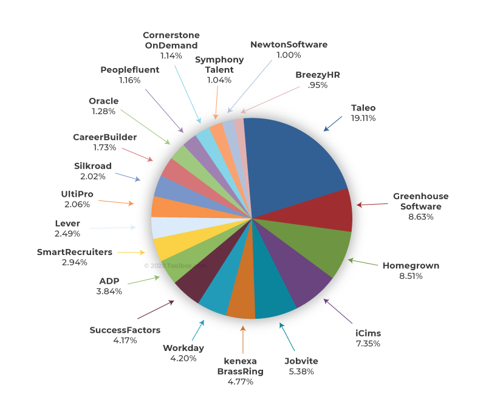

# awesome-ats

### List of application tracking systems that helps to store people data and hiring

Updated 08.09.2022

----

## What is Application Tracking System?

An applicant tracking system (ATS) is a software application that enables the electronic handling of recruitment and hiring needs. An ATS can be implemented or accessed online at enterprise- or small-business levels, depending on the needs of the organization; free and open-source ATS software is also available. An ATS is very similar to customer relationship management (CRM) systems, but are designed for recruitment tracking purposes. In many cases they filter applications automatically based on given criteria such as keywords, skills, former employers, years of experience and schools attended. This has caused many to adapt resume optimization techniques similar to those used in search engine optimization when creating and formatting their resume.

A dedicated ATS is not uncommon for recruitment-specific needs. On the enterprise level it may be offered as a module or functional addition to a human resources suite or human resource information system (HRIS). The ATS is expanding into small and medium enterprises through open-source or software as a service offerings (SaaS).

The principal function of an ATS is to provide a central location and database for a company's recruitment efforts. ATSs are built to better assist management of resumes and applicant information. Data is either collected from internal applications via the ATS front-end, located on the company website or is extracted from applicants on job boards. Most job and resume boards (Reed Online, LinkedIn.com, Monster.com, Hotjobs, CareerBuilder, Indeed.com) have partnerships with ATS software providers to provide parsing support and easy data migration from one system to another. Newer applicant tracking systems (often the epithet is next-generation) are platforms as a service, where the main piece of software has integration points that allow providers of other recruiting technology to plug in seamlessly. The ability of these next-generation ATS solutions allows jobs to be posted where the candidate is and not just on-job boards. This ability is being referred to as omnichannel talent acquisition.

Recent changes include use of artificial intelligence (AI) tools and natural language processing to facilitate guided semantic search capabilities offered through cloud-based platforms that allow companies to score and sort resumes with better alignment to the job requirements and descriptions. With the advent of ATS, resume optimization techniques and online tools are often used by applicants to increase their chances of landing an interview call.

Applicant tracking systems (ATS) have never been more important than they are right now. As the Great Resignation has continued, with the U.S.’s quit rate reaching a 20-year high in November 2021, companies have found themselves needing to fill a lot of positions quickly. In fact, 84% of companies reported that they struggled with labor shortages in 2021. Alas, many recruiters simply can’t hire people quickly enough when they do everything manually.

(c) Wikipedia

Applicant tracking tools, which streamline the application, interview, and follow-up process, are critical to your company being able to act more quicky on qualified candidates, which gives you a distinct hiring advantage.

Applicant tracking system (ATS) software is an HR (human resources) tool that organizes, standardizes, and reports on a company’s entire hiring process. A business that implements an ATS benefits from a streamlined hiring workflow with job postings, career site builders, interview tools, approvals workflows, notifications, email integration, and analytics.

Moreover, applicant tracking systems give human resources an organized and standardized recruitment process to follow. A hiring manager approves the job description which a team member posts to the job board. Then, the software connects all relevant documents that candidates submit like résumés, cover letters, and notes to the job description, so hiring teams can make direct comparisons among candidates.

While the human resources team owns the software, hiring managers and interviewers also need access to the software. HR can access the full range of hiring tasks in a single interface from candidate sourcing through evaluation, hiring, and follow-up. Companies can track each part of the application and hiring process in the tool, from start to finish. However, applicant tracking systems do not typically provide onboarding tools.

Some ATS options use keyword matching or AI-powered résumé parsing to automatically filter unqualified candidates from the hiring pool. Team members review applications, make notes, message other team members, and record candidate feedback right in the software. With approval triggers, workflows, and document storage, HR reps automatically send offer letters, contracts, and follow-up emails to candidates based on approvals or rejections during the recruitment process.

## Why do you need applicant tracking software?

Applicant tracking systems can make recruiting vastly more efficient, allowing them to hire more people with less time and effort. These systems help employers dig through high volumes of résumés to quickly find candidates with the right qualifications, so hiring managers can spend their time qualifying candidates for soft skills not found on a résumé like creativity and collaboration. This is very important because 72% of HR departments cite a lack of qualified candidates as a major issue.

ATS tools can also help companies promote diversity initiatives by tracking key diversity metrics that provide insight into the tools and strategies that help the company hire a more diverse employee base. With Gartner naming DE&I (diversity, equity, and inclusion) one of the top five HR trends for 2022, this will continue to be a focus for ATS platforms moving forward.

The software also helps companies respond quickly to job seekers, which increases overall candidate satisfaction. According to one 2020 survey of job applicants, 33% did not receive a follow-up email from the company they applied to, a problem easily fixed with automated workflows in an ATS.

## How ATS systems work

Once a candidate completes a job application on the website, the ATS automatically parses and screens résumés according to previously determined keywords. The ATS passes along qualified talent to the recruiting team for follow-up by sending an email or in-app notification.

As the hiring team moves candidates through the recruiting process, the candidate’s résumé, interview answers, video interview recordings, and other key documents are saved in a single interface. Hiring managers can review the assets at their convenience, add notes, up- or down-vote the candidate, and send email or text message alerts to the candidate about their progress.

Many ATS systems also integrate with recruiters’ calendars to automatically schedule interviews for each qualified candidate. Offer letters and other document templates can be created to save time, and some systems may also provide background checks or verify paperwork during the onboarding process.

Finally, the ATS database saves the files of qualified applicants for future reference. This helps the recruiting team build a passive candidate pool for future openings.

## Major features of applicant tracking systems

ATS systems are the company’s digital hub for hiring. It centralizes an organization’s recruitment database by housing all information on candidates, job openings, and placements. The following are key components that modern applicant tracking systems should offer.

### Career site
An ATS system should include a brandable portal featuring job descriptions, customized input forms, pre-screening questions, automated résumé screening, candidate ranking, and email notifications. Good ATS systems also include a company-facing portal where employees can view job postings, apply, or refer outside candidates.

Keep in mind that while some ATS tools will let you host your own careers site on a page on your own website, others will require that your careers site will be hosted on their own platform. There are pros and cons to either option.

### Advanced search
This powerful search and sorting feature lets recruiters quickly filter candidate listings by keywords, phrases, and skills or experience. Since an ATS works as a database of all potential candidates, this information can help HR professionals find the perfect fit for their current open position and understand the types of individuals who apply for their positions as well. Companies can also use this data to write better job applications to attract better candidates from the beginning.

### Candidate profiles
Candidate profiles include the ability to upload interview notes, files, documents, and additional information to a candidate’s CV. Thus, assessment tools and reference checking are important components of this candidate information function. Some vendors may refer to the overall workflows of organizing applicant communications as candidate relationship management.

### Interview tools
Automatic interview scheduling, video interviewing, and the ability to record and track notes from candidate interviews are becoming increasingly popular. Major ATS systems provide these options directly or through integrations with third-party tools to facilitate digital interviews.

### Analytics and reporting
A digital, paperless recruiting process allows you to gather, store, and generate reports to help you pinpoint bottlenecks in your talent acquisition process. The system should let you track your social sourcing efforts to gain visibility for specific job openings, track listing engagement, and even manage advertising campaigns.

### Other features
Additional functionality and workflow customizations will vary from system to system. These may include website integrations, job ads, document collaboration, event management, rules and permissions, and integrated marketing automation tools. Some vendors will include them as standard, while others may offer them as add-ons.

## ATS software vs. recruiting software

An applicant tracking system is a major component of recruiting software; though, recruiting software generally includes many other tools that increase its talent acquisition capabilities. Applicant tracking systems started as a way to scan paper résumés into a database. The technology evolved to filter, manage, and analyze candidates in the hiring workflow. You can find an ATS in nearly any HR software because it’s a useful tool for businesses of any size.

By comparison, recruiting software is best suited for recruiting agencies and enterprise businesses, as it equips users with tools to hire employees at scale: task management, social recruiting, public relations, CRM, billing, and a portal for clients.

Compared to ATS systems, recruitment software is considered a complete solution for an organization’s hiring process. However, the market is changing rapidly and talent management software is at a crossroads. The line between system types is blurring, as vendors constantly release new features to differentiate themselves in a crowded market. These next-generation options swiftly become standard, and buyers are left with no obvious way to discern between systems.

Additionally, this constant market transformation creates a confusing lexicon with little standardization amongst providers. For example, you will find some vendors strictly call their solution an ATS, though it could be considered recruiting software since it covers sourcing, tracking, onboarding, and analytics. On the other hand, many vendors market their solution as recruiting software, despite only containing features of an in-house ATS.

The overwhelming number of features and ATS options available and the variety of names companies use to describe these options—hiring software, human capital management, talent life cycle management, recruiting software—makes performing an applicant tracking system comparison difficult.

There’s no denying that talent acquisition is a critical and strategic HR function. So, while the market fights over definitions and what to call features, we advise that you don’t get caught up on how vendors label themselves. Instead, keep your focus on the goals of your business, and learn what you want your system to do for you.

What problem are you trying to solve?
Where can you streamline and automate your hiring process?
What is your old software missing?
Answering these questions will determine what you need from a new system, which means you get the best software for your business—whether it’s called ATS, workforce recruiting, talent acquisition, or something else entirely.

## Applicant tracking software trends

The hiring world is now focused on managing a company’s people network. Today’s HR teams use social media, in-person events, marketing tools, and hiring customer relationship management (CRM) solutions in addition to traditional résumé tools. The intersection of several key trends is driving ATS innovation.

### Artificial intelligence
As one of the biggest trends driving ATS development, AI can help automate many of the repetitive tasks of the hiring process, freeing up precious time for recruiters to spend one more valuable activities. However, AI does have its drawbacks, including trained behavior mitigating diversity and inclusion efforts and missing qualified candidates. But with proper and unbiased training and some human oversight, AI can be  a powerful and useful element of any ATS system.

### Candidate assessments
Can you tell if your candidates are qualified or just selling themselves? With online tests, you can validate skills and ensure your candidate is a good fit from the start. Hiring assessments can include skills tests completed in the ATS, personality tests from outside vendors, and custom questions provided by the hiring managers.

### Social recruiting, employee referrals, and online talent networks
Social recruiting can draw on data from social networks and use personalized messaging, gamification, and automation to target active and passive candidates and improve candidate engagement. Recruiting is moving beyond job postings, so employers must develop a talent pool made up of fans, candidates, employees, alumni, and even customers. These connections can be used to gain employee referrals and find talent faster.

### Video interviewing
In addition to recruiting internationally, easing scheduling conflicts, and improving the candidate experience, video meetings and interviews guarantee authenticity and standardization in the selection process. All qualified job seekers or applicants will undergo the same interview process, and hiring groups can independently evaluate each candidate.

Also Read: A Short Guide to Video Conferencing Etiquette

### Web-based and mobile-first platforms
Modern web-based software deployments and mobile-first platforms make hiring anytime and anywhere possible. The majority of Americans have a smartphone within reach 24/7, so mobile-optimized career pages allow candidates to apply and interview right from their phone. Additionally, HR managers can move away from desktops and laptops and recruit, manage interviews, and qualify candidates on tablets, phones, and other devices.

### Building an end-to-end workforce management solution
An applicant tracking system is no longer simply a repository for résumés. Now that the entire hiring process has gone digital, companies know they can use recruiting data and analytics to optimize their processes. Recruiters can predict which candidates fit the position based on their application data. They can also analyze the recruitment marketing programs, candidate experience, mobile apps, and social media usage to increase the likelihood of finding the right candidates.

Since hiring transitions into onboarding and talent management, more and more companies seek an all-in-one system that handles other HR processes in addition to applicant tracking functionality. Vendors that offer a full HR suite can eliminate duplicate data and inefficient workforce management across an organization.

## Applicant tracking software applications for different business sizes

It’s best to view choosing an applicant tracking system as finding a strategic business partner rather than just picking a software vendor. You’ll need a platform that sustains a long-term relationship and meets your changing business needs. Different business sizes and types may need additional tools, so it’s important to consider common ATS applications to ensure the vendor you choose is a good culture fit. The market is generally divided into three tiers:

### Enterprise ATS systems
Large organizations need an applicant tracking system that integrates with existing HR or enterprise resource planning (ERP) systems. Highly complex global enterprises also require strong collaboration, allowing recruiters to share applicant data and receive feedback from hiring managers. Large companies with legacy applications in desperate need of an upgrade should consider integrated suites from one vendor or ensure any new ATS will integrate seamlessly with existing systems.

### Agency ATS tools
For high-volume recruiting, staffing agencies need many of the same options as enterprises. But agencies need additional features to handle client needs, such as customer relationship management (CRM) functionality. Moreover, agencies should consider industry-specific recruiting software. However, applicant tracking software quickly evolves, so software purchases should be based on functionality rather than labels.

### SMB ATS solutions
Thanks to SaaS deployments, small- and medium-sized businesses (SMBs) can get the benefits of an enterprise ATS in a simpler and more economical format. SMBs should put scalability near the top of their requirements list. This can be judged based on the amount of available data storage, the pricing of additional job postings, or extra tools available at higher pricing tiers.

Some businesses with no HR department initially sign up for a free applicant tracking system with limited functionality. This can be a great option for startups, but growing companies will eventually need a paid solution to handle more positions, users, and tech support.

As an SMB scales, it can be tempting to upgrade with a vendor in order to circumvent data transfer to another system. But while the current vendor worked for previous hires, different tools may be needed to keep up with growth.

## How to create executive buy-in for an ATS system purchase

Creating executive buy-in is one of the most challenging portions of the software adoption process. To overcome this obstacle, you’ll need to build a compelling proposal that addresses how individual departments, as well as the company as a whole, will benefit from the new ATS.

Executives invest in solutions that save or help make money, avoid risk, or serve long-term strategic purposes. To ensure successful adoption and long-term ROI, you must appeal to the differing pain points of your C-level audience, so they see the need for an ATS.

Applicant tracking systems streamline administrative tasks, simplify the hiring process for hiring managers, and create one central location for all your workforce data. To create a common language and shared perspective, you’ll need to connect the dots for other decision-makers. You should speak their language and use data to back up your proposal. Below are a few ways to align your initiative.

### CTO/CIO
Talking to your technology leadership before a project starts may feel like overkill, but it’s important to involve them in new requests as early as possible. Your company’s IT department is constantly aligning company goals and infrastructure, security, downtime, data back-up, and so on. IT helps your business function efficiently and stay agile and competitive in the market. Therefore, you should seek their advice early and often to minimize implementation issues later.

Chief information officers (CIOs) can help ensure an ATS system aligns with the company’s growth and three to five year technology life cycle plan. They’ll likely be interested in solutions that reduce infrastructure requirements, updates, and support as well as the potential to reduce their needs for internal infrastructure. They’ll eventually manage your ATS anyway, so make the IT department your ally upfront. When HR and IT can stand together behind a new proposal, you’ll have a better chance of buy-in from other executives.

### CEO
Your chief executive officer (CEO) is concerned about the big picture rather than the specific functionality an ATS offers. Talent and leadership shortages are a huge business challenge: Recruiting and hiring tied with HR data analytics as the No. 1 HR concern for 2022, per PWC’s annual HR Tech Survey. HR technology can alleviate these concerns.

With data the ATS generates, HR departments can provide key information on applicant conversion rates, how long it takes to review résumés, and interview-to-hire pipelines. These tools can also predict what skills will be needed and help HR plan for those changes. Time saved by automating hiring tasks can then be used to focus on improving strategic initiatives that attract and retain talent.

### CFO
Before your initial meeting with the chief financial officer (CFO), you should know how much an ATS costs and how much it can save the company. Prices vary with inclusions and add-ons, but your shortlist isn’t the only item your CFO needs to see. You should be prepared with ways an ATS will give back to the company. Consider presenting the following metrics and how technology can improve or affect them:
- Hours spent by HR per new hire
- Turnover rate and loss of revenue per vacant position
- Number of résumés received per job
- Cost of ATS per year, per new hire, and per applicant
- Time spent on old processes versus time spent with new ATS (this estimate may come from a free trial, demo, or case studies in your industry)
- In short, you’ll need to know the potential ROI (return on investment) and prove that a modern system will allow you to continually measure new hire quality as well as use that information to fine-tune the recruiting process.

ref: [Technology Advice](https://technologyadvice.com/applicant-tracking-systems/)

Market share of top ATS solution providers [Source](https://blog.ongig.com/applicant-tracking-system/top-ats-systems-used-by-the-fortune-500-2019/)

----

## Popular Application Tracking Systems

### AmazingHiring

AI sourcing technology that helps you find 40% more candidates from 50+ open sources online.

Site: https://amazinghiring.com/

### Avature

Avature ATS redefines the user experience for candidates, recruiters and hiring managers.

Site: https://www.avature.net/

### BambooHR

BambooHR provides solutions ideal for small and midsize businesses. With a mobile app to enable easy access, it offers tools for onboarding, e-signatures, attendance tracking, and performance management.

Pricing: BambooHR has two pricing plan options: Essentials and Advantage. On average, it is $99 per month after a free seven-day trial. It would be best to get in touch with the company for an accurate quote.

Best features:
- User-friendly and easy to learn
- Streamlined processes for candidates to follow and easy onboarding
- Customizable email templates and message scheduling for multiple candidates
- Integration with job boards and social media

Site: 

### Breezy HR

Find & Hire Employees, Sooner

Site: https://breezy.hr/

### Bullhorn

Bullhorn is primarily a cloud-based recruitment software tool that is best suited for staffing and recruitment processes. Being mobile-friendly, Bullhorn ATS allows immediate data entry from anywhere.

Pricing: Bullhorn offers four pricing modules: Team, Corporate, Enterprise, and Enterprise Plus. Online reviews reveal that the packages and price quotes vary based on specific business requirements.

Best features:
- Easy access and management of candidate data
- Allows the addition of notes to records
- Easy tracking of all email interactions with any specific candidate
- Real-time updating of records
- Viable reporting and management options for the recruiting team’s progress
- In-system access to LinkedIn records

Site: https://www.bullhorn.com/products/applicant-tracking-crm/

### ClearCompany:

A Complete Talent Management System to Quickly Hire and Engage Top Talent

Site: https://www.clearcompany.com/

### CleverStaff

Customizable ATS software for recruitment

Site: https://cleverstaff.net/

### FreshTeam

Everything you need in an online applicant tracking system

Site: https://www.freshworks.com/

### GreenHouse

Besides providing applicant tracking, Greenhouse also offers holistic HR administration to create focused interviews and a culture that is free of bias. This software system can be adapted for any team size and can be accessed via the mobile app as well.

Pricing: Three pricing plans are available: Core, Pro, and Enterprise. The average cost falls within the range of $6,000 to $25,000 per year.

Best features:
- Easy tracking with the help of candidate scorecards
- Creation of customized assessment plans for interviewers to evaluate the right skill set and qualifications
- Customization of career pages, job boards, and email templates
- Simplified configuration of reports
- Best for mid-sized companies growing fas

Site: https://www.greenhouse.io/

### HuntFlow

Huntflow is the #1* recruiting system in Russia that helps you close more vacancies in less time

Site: https://huntflow.ru/

### IBM Kenexa BrassRing

IBM Kenexa BrassRing is a cloud-based ATS solution that draws on behavior marketing to attract and engage talent proactively. The software provides a plethora of recruitment features for end-to-end process management.

Pricing: Shared after the company performs a business needs analysis.

Best features:
- Access to a wide range of talent pools
- Engaging and effective assessments
- Powered by IBM Watson analytics and can thus find the best-fit quickly
- Optimized for social media-based recruiting

Site:

### iCIMS

iCIMS Recruit, with a decade of experience to back them up, offers solutions for organizations of different sizes catering to diverse industries. With over 4,000 clients, including about 20% of the Fortune 100, the platform comprises its Recruitment Marketing Suite, Advanced Communications Suite, Hiring Suite, and UNIFi – iCIMS’ ecosystem of integrated partner products and services.

Pricing: While you are advised to request a quote suited for your specific needs, the average cost for an employee base of 51–100 is $6,000 per year and for the strength of above 5,000 employees, it is $140,000 annually.

Best features:
- Management of job advertisements
- Better searches through collaboration with Google and social media
- Personalized dashboards with real-time insights
- Real-time screening and assessment results

Site: https://www.icims.com/

### JazzHR

Find and hire the right talent, fast with the only hiring platform built for businesses like yours.

Site: https://www.jazzhr.com/

### Jira Work Management

Boost your organization's productivity, coordination, and engagement — so you and your HR team can focus on people first.

Site: https://www.atlassian.com/software/jira/work-management/hr

### JobToolz

Jobtoolz is a recruitment platform for SMEs and organisations, with a strong focus on employer branding, an automated recruitment process and recruitment marketing.

Site: https://jobtoolz.com/

### JobVite

Cloud-based and candidate-focused, Jobvite ATS enables social recruiting, creating and managing mobile-optimized career sites, and onboarding functions. They also have a mobile app for the tool. The software provides specific features for interviews, requisitions, and employee referrals. This solution is best suited for medium and large-size companies.

Pricing: Online reviews peg the price for 26 to 50 employees at $4,000 per year and that for 2,501–5,000 employees at $100,000 per year. That said, it might be best to get a customized quote.

Best features:
- Easy employee referrals
- Automatic screening and interview-based candidate ranking
- Mobile-friendly application processes for candidates
- Smart Scheduler feature, which looks at the schedules for multiple interviewers and picks the best time to schedule a new interview
- Single record maintained for all conversations with a specific candidate across channels
- Powerful search tool to look for candidates by name, keywords, workflow, location, or date of application

Site: https://www.jobvite.com/products/

### LeverTRM

LeverTRM — A Full Talent Acquisition Suite

Site: https://www.lever.co/

### LinkedIn Recruiter

Hire the right candidates faster with an easy recruiting solution and powerful insights from LinkedIn’s active community.

Site: https://business.linkedin.com/talent-solutions/recruiter

### Manatal

AI Recruitment Software designed to source and hire candidates faster. Tailored for HR teams, recruitment agencies, and headhunters.

Site: https://www.manatal.com/

### PeopleForce

The best All-In-One HR software to manage your workforce

Site: https://peopleforce.io/

### PinPoint

Modern applicant tracking software and unlimited help from our team means you’ll attract the right candidates, select the best, and wow your new hires from the moment they say ‘yes’.

Site: https://www.pinpointhq.com/

### Recruitee

Working with your teammates means you can hire better and faster while making long-lasting connections with top talent.

Site: https://recruitee.com/

### RecruiterBox

Site: 

### SAP SuccessFactors

SAP SuccessFactors provides a holistic, cloud-based HR management system from sourcing, screening, and onboarding to payroll management, employee engagement, and performance metrics. Specialized recruiting software enables all processes of the recruiting cycle.

Pricing: The SAP SuccessFactors Recruiting software is priced at $3 per user per month, while the HCM suite costs $84.53 per user per year.

Best features:
- Centrally managed global job distribution and access
- Insight into 4,000 job boards, social media portals, and campuses from 80 countries across the globe
- Creation of a responsive career site
- Effective candidate relationship management
- Online offer letter and e-signature solutions

Site: 

### SmartRecruiters

SmartRecruiters is best suited for enterprise-grade needs. The Talent Acquisition Suite comes with pre-integrated assessment tools and allows better communication via scheduled notifications and auto-replies.

Pricing: The SmartStart package is free and can be used for up to 10 hires. The SmartRecruit plan is priced at $10,000 per year. It allows the integration of future add-ons for a growing employee base or if the organization plans on going mobile with their application tracking, for example.

Best features:
- Easy communication and collaboration within the hiring team
- Easy tracking of message records
- Consistency and compliance with the creation of a template library
- Personalized tags to manage and coordinate talent pools better
- Advanced filter search

Site: https://www.smartrecruiters.com/

### Taleo (Oracle)

Oracle Taleo is a cloud-based software that provides talent acquisition, development, and retention solutions. With end-to-end automation of recruiting processes, it can be modified to suit the needs of any business.

Pricing: Besides providing a free demo option, the Oracle Taleo business edition offers a choice between three pricing plans: Emerging EDU ($29 per month), Developing EDU ($54 per month) and Developed EDU ($83 per month).

Best features:
- Easy recruitment marketing
- Increased employee referrals with the use of social media tools
- Anytime-anywhere data access
- Seamless integration with Microsoft Outlook, MyYahoo, and iGoogle

Site: https://www.oracle.com/human-capital-management/taleo/

### TeamTailor

The recruitment & employer branding ATS

Site: https://www.teamtailor.com/

### TrakStar

Online applicant tracking tools for the best candidates and hassle-free hiring

Site: https://hire.trakstar.com/

### VidCruiter

Easy-to-Use Applicant Tracking System

Site: https://vidcruiter.com/

### Workable

Workable is a holistic recruiting tool that can be accessed on the desktop and mobile. This system provides easy single-point access to candidate profiles, team communications, interview schedules, and scorecards.

Pricing: Workable offers three pricing plans: Pay as you go ($50 per job, per month), Starter, and Pro. There is the option of the 15-day free trial with the first two options, but we recommend getting a personalized quote.

Best features:
- Data protection with access rights for the hiring team
- Easy reporting lines with role-assignment, job creation, and posting
- The ability to control the confidentiality of records and reports
- Productivity and activity reports are regularly generated for the hiring team
- Posting on multiple job boards with a single click
- Easy scheduling with email-calendar synchronization

Site: https://www.workable.com/

### WorkDay

A talent acquisition solution that’s agile and intelligent

Site: https://www.workday.com/en-us/products/talent-management/talent-acquisition.html

### Zoho Recruit

Zoho Recruit offers a powerful ATS and CRM in a single recruitment platform. With scalability, customization, and remote hiring tools, Recruit has everything your staffing agency or internal HR team needs to match the right candidate to the right role.

Site: https://www.zoho.com/recruit/

----

### *** Specific platforms:

### E-Staff (Russia only, outdated)

Site: https://e-staff.ru/

### FriendWork (Russia only)

Site: https://friend.work/

### Potok (Russia only)

Site: https://talenttech.ru/potok/

### SberPodbor (Russia only, unsafe!)

Site: https://sberpodbor.ru/

### Talantix (Russia only, unsafe!)

Site: https://talantix.ru/

----

### See also:

[What Is An ATS? 8 Things You Need to Know About Applicant Tracking Systems](https://www.jobscan.co/blog/8-things-you-need-to-know-about-applicant-tracking-systems/) by Robert Henderson

[Top 10 Applicant Tracking Systems (ATS) Software for 2022](https://www.spiceworks.com/hr/recruitment-onboarding/articles/top-applicant-tracking-systems/)

----

### TODO list:

- Complete the list and complete the descriptions
- Take logos
- Take screenshots
- Take promo descriptions
- Make a comparison table
- Make unsafe and specific moments

https://www.spiceworks.com/hr/recruitment-onboarding/articles/top-applicant-tracking-systems/

https://technologyadvice.com/applicant-tracking-systems/